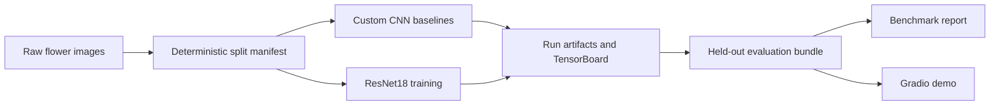

# Kaggle Flower Recognition CNN

[](https://github.com/Aeryes/Kaggle-Flower-Recognition-CNN/actions/workflows/ci.yml)


[](LICENSE)

An end-to-end, reproducible PyTorch project for classifying **daisies, dandelions, roses,
sunflowers, and tulips**. It modernizes an older CNN experiment with deterministic data splits,
tracked training artifacts, held-out evaluation, CI, and an interactive Gradio demo.

## Results

All models used the same seed-7 stratified split: 3,021 training images, 648 validation images, and
648 held-out test images.

- **ResNet18 transfer learning:** 94.75% test accuracy and 94.79% macro F1
- **Custom CNN V2:** 84.57% test accuracy and 84.17% macro F1
- **Historical custom CNN:** 79.63% test accuracy and 79.54% macro F1

The improved custom model gained **4.94 percentage points** through residual squeeze-excitation
blocks, stronger augmentation, mixed precision, and modern optimization. ResNet18 remains the
recommended deployment model.

Full metrics, per-class results, predictions, and training curves are available in
[`reports/benchmark`](reports/benchmark).

## Quick start

```bash
python -m pip install --user uv
python -m uv sync --extra dev
python -m uv run kaggle datasets download -d alxmamaev/flowers-recognition -p data/raw --unzip
python -m uv run flower-prepare-data --config configs/resnet18.yaml
python -m uv run flower-train --config configs/resnet18.yaml
```

Inspect the run in TensorBoard:

```bash
python -m uv run tensorboard --logdir artifacts/runs
```

## Highlights

- No machine-specific paths. Everything is config-driven.
- Deterministic train, validation, and test splits recorded in a manifest.
- Reproducible runs with saved config, environment metadata, TensorBoard logs, checkpoints, and
  evaluation bundles.
- Side-effect-free Python package under `src/flower_classifier/`.
- Fair comparison of two from-scratch CNNs and a transfer-learning baseline.
- CUDA mixed-precision training on supported NVIDIA GPUs.
- Tests, Ruff, GitHub Actions CI, and a Gradio demo.

## Project layout

```text
.
├── app.py
├── configs/
│   ├── custom-cnn.yaml
│   ├── custom-cnn-v2.yaml
│   └── resnet18.yaml
├── data/
│   ├── processed/
│   └── raw/
├── reports/
│   └── benchmark/
├── src/
│   ├── cnn_main.py
│   ├── classify_new_image.py
│   ├── image_loader.py
│   └── flower_classifier/
├── tests/
├── .github/workflows/ci.yml
├── MODEL_CARD.md
├── pyproject.toml
├── requirements.txt
└── uv.lock
```

## Environment setup

This project uses `uv` for environment management and locking.

```bash
python -m pip install --user uv
python -m uv sync --extra dev
```

If you prefer `pip`, `requirements.txt` installs the local package:

```bash
pip install -r requirements.txt
```

## Dataset acquisition

The project assumes the Kaggle dataset is extracted into `data/raw/flowers/` with one directory per
class.

Kaggle CLI download command:

```bash
python -m uv run kaggle datasets download -d alxmamaev/flowers-recognition -p data/raw --unzip
```

After extraction, the expected layout is:

```text
data/raw/flowers/
├── daisy/
├── dandelion/
├── rose/
├── sunflower/
└── tulip/
```

## Reproducible workflow

1. Prepare the split manifest:

   ```bash
   python -m uv run flower-prepare-data --config configs/custom-cnn.yaml
   ```

2. Train the historical baseline:

   ```bash
   python -m uv run flower-train --config configs/custom-cnn.yaml
   ```

3. Train the residual custom CNN:

   ```bash
   python -m uv run flower-train --config configs/custom-cnn-v2.yaml
   ```

4. Train the transfer-learning baseline:

   ```bash
   python -m uv run flower-train --config configs/resnet18.yaml
   ```

5. Rebuild or inspect a test evaluation bundle:

   ```bash
   python -m uv run flower-evaluate --config configs/custom-cnn.yaml --checkpoint artifacts/runs/<run-id>/checkpoints/best.pt
   ```

6. Generate a comparison report:

   ```bash
   python -m uv run flower-benchmark \
     --run-dir artifacts/runs/<custom-run-id> \
     --run-dir artifacts/runs/<custom-v2-run-id> \
     --run-dir artifacts/runs/<resnet-run-id> \
     --output-dir reports/benchmark
   ```

## Artifact contract

Every training run writes to `artifacts/runs/<run-id>/`:

```text
artifacts/runs/<run-id>/
├── checkpoints/
│   ├── best.pt
│   └── latest.pt
├── evaluation/test/
│   ├── confusion_matrix.png
│   ├── predictions.csv
│   ├── sample_errors.json
│   └── summary.json
├── tensorboard/
├── environment.json
├── metrics.csv
├── metrics.json
├── resolved-config.yaml
├── split-manifest.json
└── status.json
```

This makes each run inspectable and repeatable without relying on local memory or terminal output.

## Observability

Launch TensorBoard against the run artifacts:

```bash
python -m uv run tensorboard --logdir artifacts/runs
```

Each run includes:

- Training and validation loss
- Training and validation accuracy
- Validation macro and weighted F1
- Learning-rate history
- Checkpoint metadata
- Confusion matrix and prediction exports
- Environment and Git metadata

## CLI entry points

- `flower-prepare-data`
- `flower-train`
- `flower-evaluate`
- `flower-predict`
- `flower-benchmark`
- `flower-preview`

Compatibility wrappers remain at:

- `src/cnn_main.py`
- `src/classify_new_image.py`
- `src/image_loader.py`

## Demo

The Gradio app auto-discovers the latest `best.pt` checkpoint under `artifacts/runs/`. You can also
point it to a specific run via `FLOWER_CHECKPOINT`.

```bash
python -m uv run python app.py
```

For a specific checkpoint in PowerShell:

```powershell
$env:FLOWER_CHECKPOINT = "artifacts/runs/<run-id>/checkpoints/best.pt"
python -m uv run python app.py
```

## Benchmark reporting

The benchmark export is written under `reports/benchmark/` and is intended to hold:

- `comparison.json`
- `comparison.csv`
- Per-run copied confusion matrices
- Per-run copied prediction exports
- Training-curve CSV exports
- Methodology notes in `reports/benchmark/README.md`

See [Results](#results) for the measured comparison. The generated report is the source of truth for
per-class metrics and run-level artifacts.

## Architecture



## Validation and CI

Local checks:

```bash
python -m uv run ruff check .
python -m uv run pytest
```

GitHub Actions runs the same checks on Python 3.12 in `.github/workflows/ci.yml`.

## Current limitations

- Custom CNN V2 remains below the 90% held-out target despite improving the original baseline.
- Model checkpoints and the Kaggle dataset are intentionally excluded from Git.
- The Gradio app requires a locally trained checkpoint or a `FLOWER_CHECKPOINT` path.

## License

This repository remains under GPL-3.0. See `LICENSE` for details.
